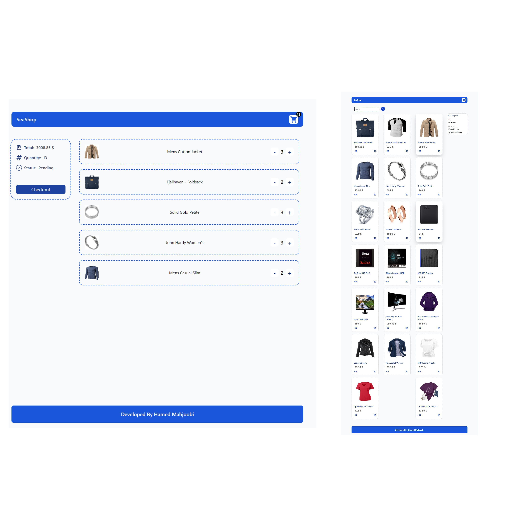

# Shopping Cart Application   

## Description: 
  Developed a single-page application (SPA) for a shopping cart using React and Redux Toolkit.
## Key Features:
### Product Search: 
  Implemented a dynamic search feature allowing users to easily find products.
### Sorting: 
  Added functionality to sort products alphabetically by name.
### Cart Management: 
  Enabled adding products to the cart, with options to increase or decrease quantities.
### API Integration: 
  Utilized Axios for efficient and streamlined data fetching.
## Technologies: React, Redux Toolkit, SPA architecture.

#### Note: In the demo of this project, when you click on the link, a 404 page will be displayed. This is expected because it doesn't recognize the main route of the project. So, please remove /products from the URL, then press enter to reload the main page. Thank you!

